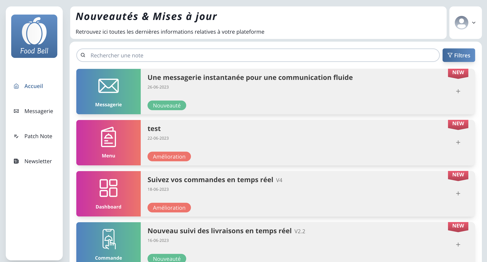
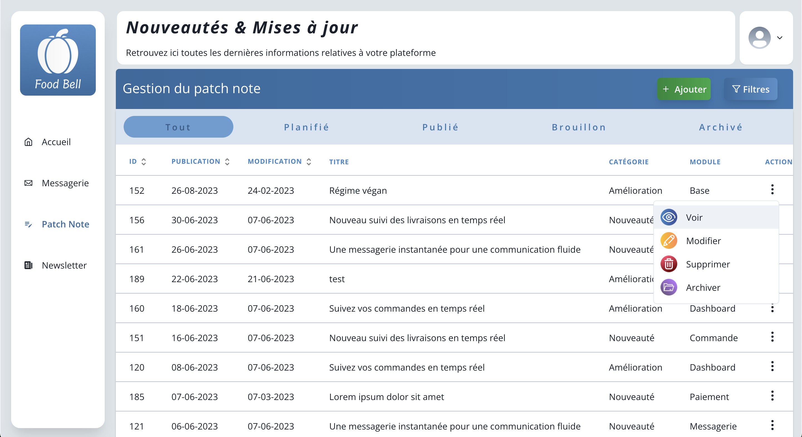

# Food Bell Patch Note

The Food Bell Patch Note is a solo project where I analyzed, designed, and developed a patch note system for the fictive website, Food Bell.

This project provided me with the opportunity to enhance my skills in React and learn .Net, as it was my first exposure to the framework.

I took on all aspects of development independently, showcasing my skills and passion for web development. The project reflects my commitment to continuous learning and improvement in the field.

Feel free to explore the features of the Food Bell Patch Note, and reach out if you have any questions or feedback.

# 1. Overview

The Food Bell Patch Note consists of two main sections: the admin and user interfaces. Users can log in as either an admin or a regular user to access different features and functionalities.

### **<span style="color:#3c84c5">Admin section</span>**

The admin section offers a range of tools and capabilities to effectively manage and enhance the Food Bell website. Key features of the admin section include:

1. **Patch Note - main page:** Browse through a list of articles detailing the latest updates, releases, and corrections made on the Food Bell website. Stay informed about the ongoing improvements and additions.

2. **Customer Recommendations:** Access a dedicated section to view recommendation messages submitted by Food Bell's customers.

3. **Article Management** Take full control over the content of the patch note by adding, deleting, and modifying articles.

4. **Newsletter Management:** Utilize the newsletter management feature to create engaging newsletters for customers. Select articles of interest and schedule their publication date, ensuring customers receive regular updates tailored to their needs.

### **<span style="color:#3c84c5">User section</span>**

The user section of the Food Bell Patch Note allows them to stay informed of the latest updates.

1. **Article Viewing:** Users can explore the articles within the patch note, gaining insights into the latest updates, releases, and corrections made on the Food Bell website

2. **Recommendation Messages:** Users have the opportunity to contribute their ideas and recommendations to enhance the main Food Bell website. If users have any recommendations or suggestions for improvement, they can leave a message via their interface.

# Features

**Multi-Language Support:** The Food Bell Patch Note website is available in three languages: English, French, and Dutch.

# Technology Stack

The Food Bell Patch Note project was developed within a bootcamp, serving as an opportunity to gain hands-on experience with cutting-edge technologies. The project was built using the following technologies:


-purple>)


# Installation:

To access the front-end of the Food Bell Patch Note, you can visit the deployed version at the following link:
<a href="https://main--patch-note-foodbell.netlify.app/" target="_blank">Food Bell Patch Note Front-end</a>

**!! Please note that the backend part of the project could not be deployed at this time !!**

To experience the full functionality of the website, please follow the instructions below to set up the project locally:

1. Clone the repository

```sh
git clone
```

2. Navigate to the project directory: Use the command line to navigate to the "patchnote" directory within the cloned repository.

```sh
cd patchnote
```

4. Switch to the Docker branch: Once inside the "patchnote" directory, switch to the "docker" branch.

```sh
git checkout docker
```

4. Start Docker: Ensure that Docker is installed on your system. Start Docker to enable containerization for the project.

5. Build and launch the containers: Run the following command to build and launch the Docker

```sh
docker-compose up --build
```

Following these steps will set up the necessary environment to run the Food Bell Patch Note locally. You can then access both the front-end and back-end functionalities of the website on your machine.

If you encounter any issues during the setup process or have any further questions, please don't hesitate to reach out for assistance. Enjoy exploring the Food Bell Patch Note!

### **<span style="color:#FF0000">ALTERNATIVE</span>**

If you wish to start the project manually here are the steps to follow:

```sh
git clone
```

STAY ON BRANCH MAIN

**FRONTEND**

Run the following commands :

```sh
cd patchnote/ClientApp
```

```sh
npm install
npm run dev
```

**BACKEND**

DATABASE

-   Set up a new mysql connection with the following

    -   host: localhost
    -   port:3306

-   Create a schema "patch_test"

-   Download the file db_mysql/DumpPatchNoteDB.sql
    and import the mysql file

-   Go to appsettings.json and add you user and password

-   Make sure you go back to /patchnote

-   Run the following commands

```sh
dotnet build
dotnet run
```

You are ready to go ! 😀



